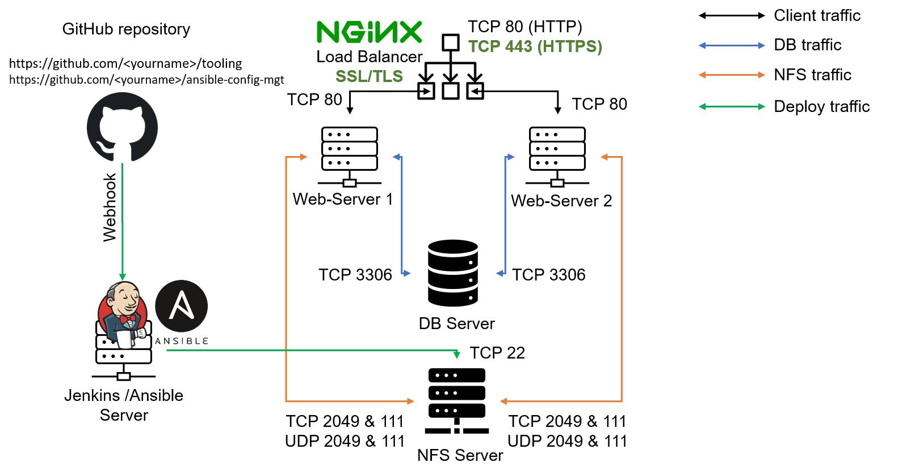

## ANSIBLE CONFIGURATION MANAGEMENT – AUTOMATE PROJECT 7 TO 10

In Projects 7 to 10 you had to perform a lot of manual operations to seet up virtual servers, install and configure required software, deploy your web application.

This Project will make you appreciate DevOps tools even more by making most of the routine tasks automated with Ansible

## INSTALL AND CONFIGURE ANSIBLE ON EC2 INSTANCE

1. Update Name tag on your Jenkins EC2 Instance to Jenkins-Ansible. We will use this server to run playbooks.


2. In your GitHub account create a new repository and name it ansible-config-mgt.


3. Instal Ansible

```
sudo apt update

sudo apt install ansible
```


Check your Ansible version by running ansible --version


4. Configure Jenkins build job to save your repository content every time you change it – this will solidify your Jenkins configuration skills acquired in Project 9.

Create a new Freestyle project `ansible` in Jenkins and point it to your ‘ansible-config-mgt’ repository.


Configure Webhook in GitHub and set webhook to trigger `ansible` build.

Configure a Post-build job to save all (`**`) files, like you did it in Project 9.


5. Test your setup by making some change in README.MD file in `master` branch and make sure that builds starts automatically and Jenkins saves the files (build artifacts) in following folder

`ls /var/lib/jenkins/jobs/ansible/builds/<build_number>/archive/`

**Note**: Trigger Jenkins project execution only for /main (master) branch.

Now your setup will look like this:



